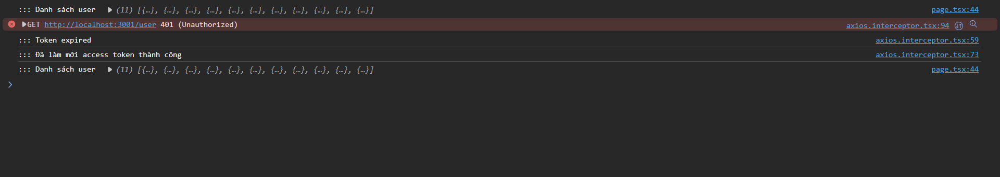

### Run server backend
```sh
   npm run start:dev
```
### Run server frontend
```sh
   npm run dev
```

### Kiến thức học được
**Backend**
- sử dụng typeorm postresql để kết nối và xử lý với cơ sở dữ liệu 
- Sử dụng passport-jwt strategy để xác thực người dùng bằng jsonweb token
- Sử dụng guard, canactive để "custom" guard để tra về lỗi khi token hết hạn hoặc người dùng chưa đăng nhập...

**Frontend**
- Render giao diện bằng tsx
- Sử dụng axios để xử lý request trước khi gửi xuống server, lấy lại access token khi hết hạn

### Demo
**Register page**


**Login page**


**Home page**


**Khi nhấn vào nút "Call API"**


**Lấy lại access token khi hết hạn (1 phút)**



